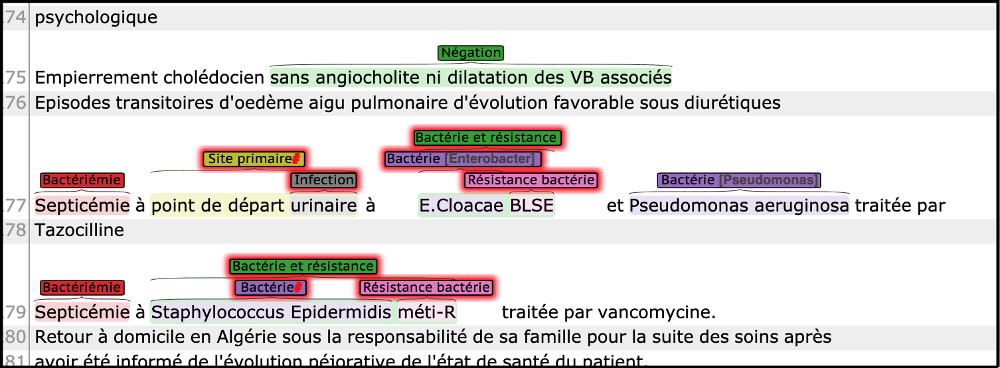

# EZAnnot

Tool for fast concept and rule-based extraction for dummies.

## Functionalities

 - Easy design of annotation schemes
 - Concept extraction based on [simstring](https://pypi.org/project/simstring-pure/).
 - Regex extraction
 - Rule-based creation and deletion of concepts at sentence level
 - Integrated section splitter (credits: Ivan Lerner)
 - Generates outputs in [Brat](https://brat.nlplab.org/) or in `pandas` dataframes.

No programing capabilities are needed for basic concept and rule-based extraction, you only handle Excel files defining your schema, your terms and your rules. Custom python function can be added for document-level and/or complex extraction rules.




## Contact

`xavier.tannier@sorbonne-universite.fr`

(Please do not use my `aphp-ext` address which I don't check on a regular basis )

## Required packages

(in addition to regular packages already included at the creation of your jupyter workspace)

- [`boolean.py`](https://pypi.org/project/boolean.py/)
- [`simstring-pure`](https://pypi.org/project/simstring-pure/)
- [`flashtext`](https://pypi.org/project/flashtext/)


## How to use

See [notebook example](./ezannot_example.md). To comply with AP-HP policy, the notebook is not executed and saved in markdown format thanks to the [Jupytext extension (refer to the documentation if need be)](https://jupytext.readthedocs.io/en/latest/). 

A few extra tips:

- Brat data must be in the `$HOME/brat_data` directory in your workspace, in order to be able to visualize it with [http://brat-cseXXXXXX.eds.aphp.fr/#/](http://brat-cseXXXXXX.eds.aphp.fr/#/) (where XXXXXX is your workspace number).

- Approximate matching can lead to unexpected behaviors for short words or different concepts having close spellings. Always evaluate the results of your work!

- You can change many parameters in the files [ezannot/configuration.py](./ezannot/configuration.py) and [ezannot/configuration_sys.py](./ezannot/configuration_sys.py)

- You should keep the headers of the Excel as in the example file. If you change the headers, and especially their number of raws, you'll have to change the corresponding parameters in `configuration_sys.py`

- The code should work with `spacy` version 2.2 (currently installed in EDS) and version 3.0. Be careful that the used model should stick to spaCy's version. You can change the model path in `configuration.py`.


## Resource creation

### Schema

See [example](./example/doc/example_schema.xlsx)

The schema is designed in a Excel file  where you list your concept types of interest, their (possible) hierarchy and their specific features.

#### Basic usage

Fill the first two columns of the schema Excel file with the names of the concept types you want to annotate. 
Make the unique identifier (column A) and the concept name (column B) the same.
Leave the other columns empty (default values are generally what you want)

#### Advanced usage

The Excel file describing your concepts contains the following columns:

| Column | Description                                                          | Comment                                                                                                                                                                                                                                                                                                                                                                                                                                                                                                                   |
|:------:|----------------------------------------------------------------------|---------------------------------------------------------------------------------------------------------------------------------------------------------------------------------------------------------------------------------------------------------------------------------------------------------------------------------------------------------------------------------------------------------------------------------------------------------------------------------------------------------------------------|
|    A   | Unique identifier of the concept                                     | Each line must be unique                                                                                                                                                                                                                                                                                                                                                                                                                                                                                                  |
|    B   | Name of the concept, with hierarchical information                   |                                                                                                                                                                                                                                                                                                                                                                                                                                                                                                                           |
|    C   | (optional) Description of the concept                                | e.g.: <ul> <li>`Disease` represents the class "disease" <li>`Disease>Cancer` represents the class `Cancer`, subclass of `Disease` (`Disease` must have been declared as a concept earlier) <li>`Disease>Cancer>XXX` represents a subclass of `Cancer` <li>`Site>Primary Site\|Direct` where `Direct` is an attribute of `Primary Site`, which is a subclass of `Site` </ul>  The hierarchical relation "`>`" expresses *is-a* relations, while the attribute relation "`\|`" represents other relations (*e.g* *part-of*) |
|    D   | Brat Type                                                            | (for non first-level concepts) Whether the concept should be represented in Brat as an entity or as an attribute of its parent <br> For Brat annotation ergonomy only, has no influence on the automatic annotation process.                                                                                                                                                                                                                                                                                              |
|    E   | Brat hierarchy-level                                                 | The level of the concept in the Brat schema (can be different than its level in the Excel schema). This can be used to flatten the hierarchy in Brat, to make the manual annotation process easier. <br> For Brat annotation ergonomy only, has no influence on the automatic annotation process.                                                                                                                                                                                                                         |
|    F   | Brat: can this concept be manually annotated and visualized in Brat? | (default yes) <br> For Brat annotation ergonomy only, has no influence on the automatic annotation process.                                                                                                                                                                                                                                                                                                                                                                                                               |


### Terminology

See [this example](./example/doc/example_terminology.xlsx), as well as the full resources for handling [negation triggers](./example/doc/example_terminology_negation.xlsx).

The terminology is made of one or several Excel files containing the terms, expressions or regular expressions mapping to the concept types you designed in the schema. 

Several Excel files can be fed into the system. Each sheet of each Excel file is parsed.


#### Basic usage

Just fill the first three columns with only standard terms

| concept_id | term | type |
|------------|------|------|
| Cancer     | carcinome | term |
| Cancer     | tumeur maligne | term |
| ...        | ...   | ... |

#### Advanced usage


These sheets define your terminology, containing the following columns:

| Column | Description                        | Comment                                                                                                                                                                                                                                                                                                                                                                                                                                                                                                                                              |
|:------:|------------------------------------|------------------------------------------------------------------------------------------------------------------------------------------------------------------------------------------------------------------------------------------------------------------------------------------------------------------------------------------------------------------------------------------------------------------------------------------------------------------------------------------------------------------------------------------------------|
|    A   | Concept identifier                 | Must have been declared in the schema Excel file, column A.                                                                                                                                                                                                                                                                                                                                                                                                                                                                                          |
|    B   | Concept text or regular expression |                                                                                                                                                                                                                                                                                                                                                                                                                                                                                                                                                      |
|    C   | Type                               | Four possibles values: <ul> <li>`entity` (default). Exact match only: only the exact spelling written in column B will be matched to the concept  <li>`term`. Approximate match will be allowed to match the concept (using `simtring`). Can be used with wild cards and generic tokens (see below). Simstring parameters for approximate matching can be changed in `configuration.sys` and in the code. <li>`regex`. Regex matching <li>`exclusion`. Exclusion by exact match: the string will be excluded from the concept if met (can be used to counterbalance approximate matching frequent errors). </ul> |
|    D   | Pre-annotation                     | (default `yes`). `No` if should not be annotated in Brat results.


#### `Term` specific syntax

A `term` can be a simple string, but can also contain:

- wild cards, such as 
   - `*` (replacing any long sequence of tokens), 
   - `...` (replacing any short sequence of tokens),
   - `.` (replacing one token)
   - `?` (replacing zero or one token)
   
   All these wild cards and others can be configured in `configuration.py`.
- The operator `<>`. `A <> B` means that the sequence `A` must be in the same sentence as `B`, no matter the order and the distance.
- The generic token `<NUM>`, representing any number
- A generic token `<ENTITY>`, where you can replace `ENTITY` by any entity type. 

For example:

- `complication vasculaire <> <Diabète>` stands for all sequences containing "*complication vasculaire*" (approx. matching) *and* an entity of type *Diabète* as defined by the schema and other lines of the terminology files.
- `suite à une ... <Infection>` stands for all sequences containing "*suite à une*" (approx. matching) followed by an entity of type *Infection*, separated by a short sequence of any tokens. 


### Rules 

See [example](./example/doc/example_rules.xlsx)

Several rules files can be fed into the system. Each sheet of each file is parsed.

**Rules are triggered at sentence level only**. For document-level or complex rules, use python custom rule functions.

#### Basic usage

A common way to use the rules is to restrict annotations to some specific sections of the records.

For example (if the section splitter is used):

| concept id | rule | action |
|------------|------|------|
| Grade_ACR     | NOT (SECTION_conclusion) | REMOVE |

will remove all concepts *Grade_ACR* that are not located in the conclusion of the record. 


#### Advanced usage


These sheets define your rules, containing the following columns:


| Column | Description               | Comment                                                                                                                                                                                                                                                                                                                                                                                                                                                                                                  |
|:------:|---------------------------|----------------------------------------------------------------------------------------------------------------------------------------------------------------------------------------------------------------------------------------------------------------------------------------------------------------------------------------------------------------------------------------------------------------------------------------------------------------------------------------------------------|
|    A   | Concept identifier        | The concept that will be removed, added or linked to when the rule is triggered. <br>  Must have been declared in the schema Excel file, column A. You can also use `*` or `ANY` to represent all entities.                                                                                                                                                                                                                                                                                                                                                       |
|    B   | Rule (logical expression) | The logical expression to be checked for the rule to be triggered. <br> Possible operators: <ul> <li>Classical `AND`, `OR`, `NOT` operators <li>`OVERLAPS`, `CONTAINS`, `IN` for checking entity overlaping or nesting </ul>                                                                                                                                                                                                                                                                             |
|    C   | Action                    | Action to be performed if the expression is True. Values can be `ADD`, `REMOVE` or `LINK`.  <ul> <li>`ADD` rule: the concept from column A will be created if the expression of column B is True <li>`REMOVE` rule: the concept from column A, if present, will be deleted if the expression of column B is True <li>`LINK` rule: the concept from column A will be linked to the first concept of the expression of column B. Currently, these links only appear in dataframe output, not in Brat </ul> |

### Custom python rule functions

See [example](./example/doc/example_custom_rules.py).

#### Basic usage

Don't use custom rule functions.

#### Advanced usage

If you cannot express what you can with Excel rules, you can code them in python.
You can declare any python function as a custom rule (see [notebook example](./ezannot_example.md)), provided that they have the following parameters and return values:

- Input parameters: 
   1. A dictionary storing all concept matches, organized by their ids. Keys: entity id, value: a list of dictionaries describing the match (see below). A match can be associated to several dictionary, but it's generally only one.
   2. A dictionary storing all concept matches, grouped by their entity types (including those deleted after rule triggering). Keys: entity type, value: list of matches

- Return values: the two exact same variables, updated by the function.

A match has the following structure:
```
{ 
    'start': start,             # start character offset in the document
    'end': end,                 # end character offset in the document
    'start_index': start_index, # start token offset 
    'end_index': end_index,     # end token offset 
    'sent_index': sent_index,   # index of the concerned sentence
    'ngram': text,              # entity text
    'type': {types},            # set of entity types (usually only one)
    'annotation_disabled: bool, # True if the match should not lead to a Brat annotation
    'related': list             # list of entity identifiers that are related to this one
                                # for example when it is built from a complex expression involving other concepts
}
```

## Outputs

### Brat

The Brat output can be visualized with the Brat annotation tool that can be installed on any workspace.

### dataframes

The dataframe output is made of four dataframes (the name below correspond to those in the example notebook):

- `df_ehr_phenotyping_ref_type`: the description of the concept types
- `df_ehr_phenotyping`: the annotations (to join with `df_ehr_phenotyping_ref_type`)
- `df_ehr_phenotyping_relation_ref_type`: the description of the relation between concepts
- `df_ehr_phenotyping_relations`: the relations (to join with `df_ehr_phenotyping_relation_ref_type` and with `df_ehr_phenotyping`)

